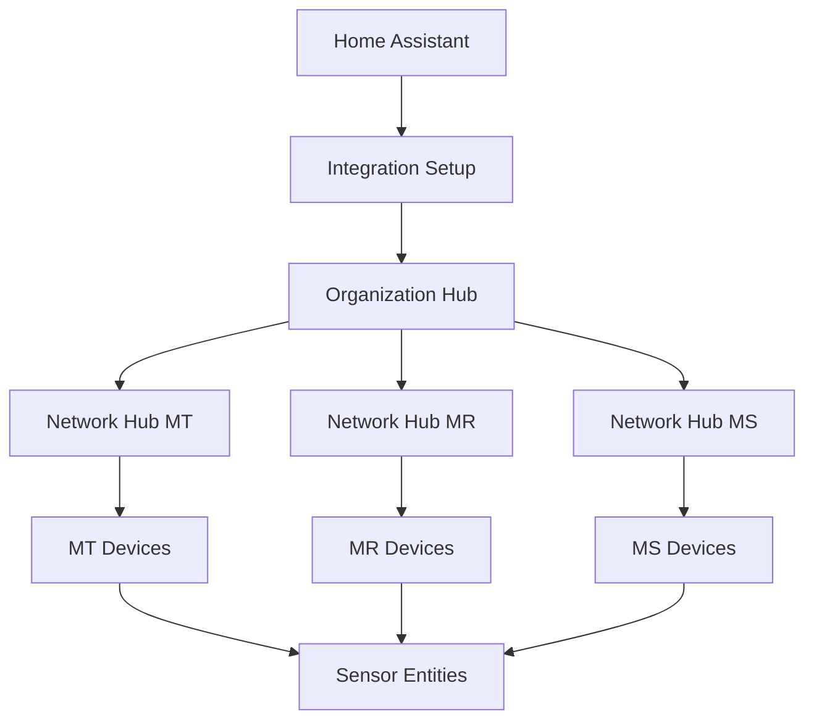

# Architecture

This document describes the architecture of the Meraki Dashboard Home Assistant integration.

## Overview

The integration follows a hub-based architecture with clear separation of concerns:



## Core Components

### Hub Architecture

**OrganizationHub**
- Root-level hub managing organization operations
- Creates and manages network hubs
- Handles organization-wide API calls
- Manages API client lifecycle

**NetworkHub**
- Device-type specific hubs (one per network/device type)
- Handles device discovery
- Manages device-specific API calls
- Implements caching strategies

### Data Flow

1. **Configuration Entry** → Integration setup
2. **Organization Hub** → Discovers networks and devices
3. **Network Hubs** → Created for each device type
4. **Update Coordinator** → Manages polling and updates
5. **Data Transformer** → Normalizes API responses
6. **Entity Factory** → Creates Home Assistant entities

### Key Design Patterns

**Factory Pattern**
- Dynamic hub creation based on discovered devices
- Entity creation based on device capabilities

**Coordinator Pattern**
- Centralized update management
- Prevents duplicate API calls
- Handles error recovery

**Transformer Pattern**
- Normalizes diverse API responses
- Provides consistent data structure
- Handles missing/malformed data

## API Integration

### SDK Usage

The integration exclusively uses the official Meraki Python SDK:

```python
import meraki

dashboard = meraki.DashboardAPI(
    api_key=api_key,
    suppress_logging=True,
    output_log=False
)
```

### Error Handling

Comprehensive error handling with decorators:

- `@handle_api_errors` - Catches and categorizes API errors
- `@with_standard_retries` - Implements exponential backoff
- `@performance_monitor` - Tracks API performance

### Rate Limiting

- Respects Meraki API rate limits
- Implements circuit breaker pattern
- Uses tiered refresh intervals

## Caching Strategy

### Three-Tier Caching

1. **Static Data** (4 hours)
   - Device information
   - Network configuration
   - License data

2. **Semi-Static Data** (1 hour)
   - Device status
   - Configuration changes
   - Network topology

3. **Dynamic Data** (5-10 minutes)
   - Sensor readings
   - Traffic statistics
   - Client counts

## Entity Management

### Entity Creation Flow

1. Device discovery via API
2. Capability detection
3. Entity description mapping
4. Entity factory creation
5. Registration with Home Assistant

### Naming Convention

```
{domain}_{device_serial}_{metric_type}
```

Example: `sensor.q2qv_wxyz_1234_temperature`

## Performance Optimizations

### Batch Operations
- Uses `total_pages='all'` for paginated requests
- Groups similar API calls
- Minimizes round trips

### Intelligent Polling
- Device-type specific intervals
- Skips offline devices
- Prioritizes active metrics

### Memory Management
- Limits cached data size
- Cleans up stale entries
- Uses weak references where appropriate

## Security Considerations

### API Key Protection
- Stored in Home Assistant's secure storage
- Never logged or exposed
- Supports read-only keys

### Data Sanitization
- PII removal from logs
- MAC address formatting
- Location data protection

## Testing Architecture

### Test Builders
- Consistent test data generation
- Mock API responses
- Fixture management

### Test Coverage
- Unit tests for components
- Integration tests for hubs
- End-to-end coordinator tests

## Future Considerations

### Extensibility
- Plugin architecture for new device types
- Custom metric definitions
- Third-party device support

### Scalability
- WebSocket support for real-time updates
- Distributed hub architecture
- Advanced caching strategies

## Best Practices

### Development Guidelines
1. All API calls through hubs
2. Use existing decorators
3. Follow entity factory pattern
4. Implement proper error handling
5. Add comprehensive logging

### Performance Guidelines
1. Batch API operations
2. Implement caching
3. Use appropriate intervals
4. Monitor API usage
5. Handle failures gracefully

## Next Steps

- [Development](development.md) - Contributing to the integration
- [API Optimization](api-optimization.md) - Best practices
- [FAQ](faq.md) - Architecture questions