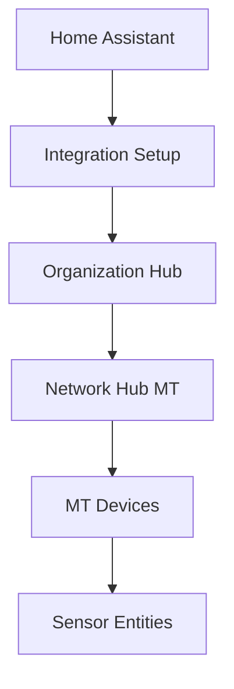
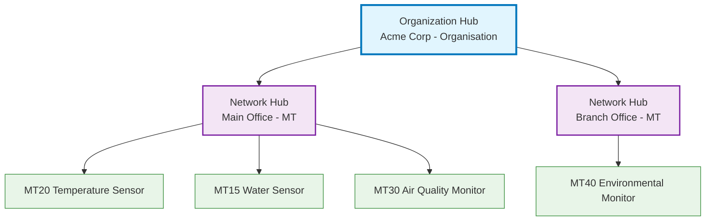

# Architecture

The Meraki Dashboard Home Assistant integration is built on a hub-based architecture that discovers Meraki organizations, networks, and MT environmental sensors, then exposes them as Home Assistant entities through a layered set of coordinators and factories.

!!! note "MT-only as of v1.0.0"
    The integration used to also support MR/MS/MV device types with their own network hubs. As of
    v1.0.0 those have been removed; only MT network hubs (plus organization-level minimal-health
    diagnostics) remain.

## Overview

The integration follows a hub-based architecture with clear separation of concerns:


```mermaid
graph TD
    A[Home Assistant] --> B[Integration Setup]
    B --> C[Organization Hub]
    C --> D[Network Hub MT]
    D --> G[MT Devices]
    G --> J[Sensor Entities]
```

## Hub Architecture Details

The integration automatically creates hubs for organization and performance:


```mermaid
graph TB
    A["Organization Hub<br/>Acme Corp - Organisation"] --> B["Network Hub<br/>Main Office - MT"]
    A --> D["Network Hub<br/>Branch Office - MT"]

    B --> F["MT20 Temperature Sensor"]
    B --> G["MT15 Water Sensor"]
    B --> H["MT30 Air Quality Monitor"]

    D --> L["MT40 Environmental Monitor"]

    classDef orgHub fill:#e1f5fe,stroke:#0277bd,stroke-width:3px
    classDef networkHub fill:#f3e5f5,stroke:#7b1fa2,stroke-width:2px
    classDef device fill:#e8f5e8,stroke:#388e3c,stroke-width:1px

    class A orgHub
    class B,D networkHub
    class F,G,H,L device
```

**Key Benefits:**
- **Automatic Organization**: Creates a network hub only where MT devices exist
- **Per-Hub Intervals**: Optimize update frequency per network
- **Scalable Performance**: A single org-wide sensor-readings call is shared across all MT network hubs
- **Minimal-Health Visibility**: Organization/network diagnostic sensors (API status, device counts) survive independently of any specific device family

## Core Components

### Hub Architecture

**OrganizationHub**
- Root-level hub managing organization operations
- Creates and manages network hubs
- Handles organization-wide API calls
- Manages API client lifecycle

**NetworkHub**
- One hub per network with MT devices
- Handles MT device discovery
- Delegates sensor reads to the organization hub's cached org-wide result
- Implements caching strategies

### Data Flow

1. **Configuration Entry** → Integration setup
2. **Organization Hub** → Discovers networks and MT devices; makes a single org-wide sensor-readings call (and a single org-wide gateway-connections call) per refresh, cached with a short TTL
3. **Network Hubs** → Created for networks with MT devices; filter the org-wide result to their own devices
4. **Update Coordinator** → Manages polling and updates (one per network hub)
5. **Data Transformer** → Normalizes API responses
6. **Entity Factory** → Creates Home Assistant entities

### Key Design Patterns

**Factory Pattern**
- Dynamic hub creation based on discovered devices
- Entity creation based on device capabilities

**Coordinator Pattern**
- Centralized update management
- Prevents duplicate API calls
- Handles error recovery

**Transformer Pattern**
- Normalizes diverse API responses
- Provides consistent data structure
- Handles missing/malformed data

## API Integration

### SDK Usage

The integration exclusively uses the official Meraki Python SDK (async client):

```python
import meraki

async with meraki.aio.AsyncDashboardAPI(
    api_key,
    suppress_logging=True,
    output_log=False,
) as dashboard:
    ...
```

### Error Handling

Comprehensive error handling with decorators:

- `@handle_api_errors` - Catches and categorizes API errors
- `@with_standard_retries` - Implements exponential backoff
- `@performance_monitor` - Tracks API performance

### Rate Limiting

- Respects Meraki API rate limits
- Implements circuit breaker pattern
- Uses tiered refresh intervals

## Caching Strategy

### Three-Tier Caching

1. **Static Data** (4 hours)
   - Device information
   - Network configuration

2. **Semi-Static Data** (1 hour)
   - Device status
   - Configuration changes
   - Network topology

3. **Dynamic Data** (5-10 minutes, short-TTL for org-wide reads)
   - MT sensor readings
   - Gateway-connection (RSSI, last-seen) data

## Entity Management

### Entity Creation Flow

1. Device discovery via API
2. Capability detection
3. Entity description mapping
4. Entity factory creation
5. Registration with Home Assistant

### Naming Convention

```text
{domain}_{device_serial}_{metric_type}
```

Example: `sensor.q2qv_wxyz_1234_temperature`

## Performance Optimizations

### Batch Operations
- Uses `total_pages='all'` for paginated requests
- Groups similar API calls
- Minimizes round trips

### Intelligent Polling
- Device-type specific intervals
- Skips offline devices
- Prioritizes active metrics

### Memory Management
- Limits cached data size
- Cleans up stale entries
- Uses weak references where appropriate

## Security Considerations

### API Key Protection
- Stored in Home Assistant's secure storage
- Never logged or exposed
- Supports read-only keys

### Data Sanitization
- PII removal from logs
- MAC address formatting
- Location data protection

## Testing Architecture

### Test Builders
- Consistent test data generation
- Mock API responses
- Fixture management

### Test Coverage
- Unit tests for components
- Integration tests for hubs
- End-to-end coordinator tests

## Future Considerations

### Extensibility
- Plugin architecture for new device types
- Custom metric definitions
- Third-party device support

### Scalability
- WebSocket support for real-time updates
- Distributed hub architecture
- Advanced caching strategies

## Best Practices

### Development Guidelines
1. All API calls through hubs
2. Use existing decorators
3. Follow entity factory pattern
4. Implement proper error handling
5. Add comprehensive logging

### Performance Guidelines
1. Batch API operations
2. Implement caching
3. Use appropriate intervals
4. Monitor API usage
5. Handle failures gracefully

## Next Steps

- [Development](development.md) - Contributing to the integration
- [API Optimization](api-optimization.md) - Best practices
- [FAQ](faq.md) - Architecture questions
