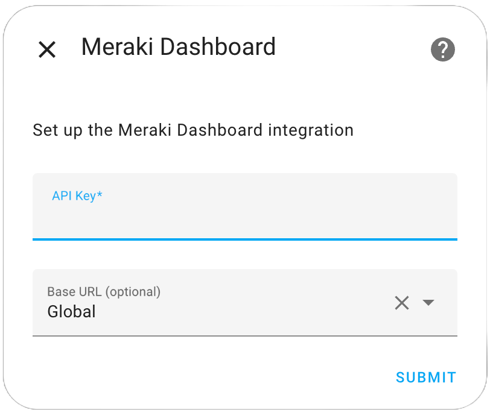
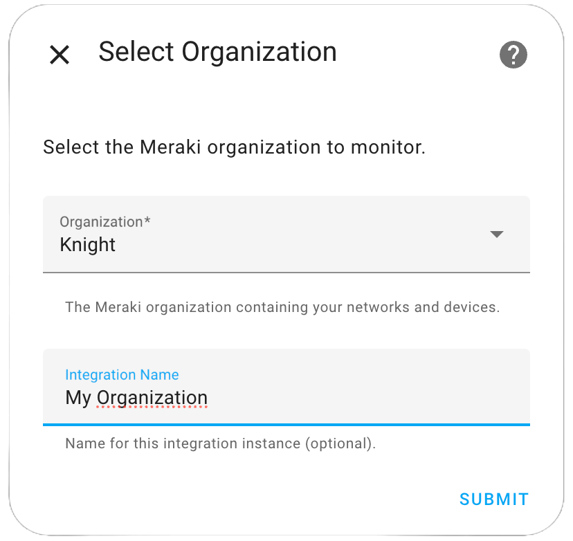
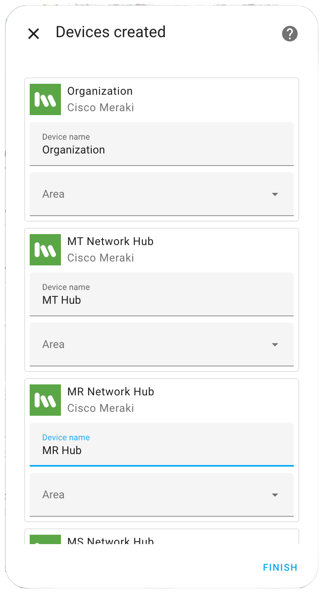

# Meraki Dashboard Home Assistant Integration

Connect your Cisco Meraki Dashboard with Home Assistant to monitor environmental sensors, wireless access points, switches, and more - all from your smart home automation platform.

## What is this integration?

This custom integration provides real-time monitoring of your Cisco Meraki devices directly within Home Assistant. Monitor temperature, humidity, air quality, network status, and device health across your entire Meraki infrastructure.

## Key Features

- **🌡️ Environmental Monitoring**: Track temperature, humidity, CO2, air quality, and more from MT sensors
- **⚡ Ultra-Fast Updates**: 7.5-second refresh for MT15/MT40 devices with automatic refresh commands
- **📡 Network Monitoring**: Monitor wireless access points, SSIDs, and network performance
- **🔌 Switch Monitoring**: Keep tabs on switch ports, PoE usage, and traffic statistics
- **🏢 Multi-Site Support**: Automatically organizes devices by network and location
- **⏱️ Smart Polling**: Device-specific update intervals optimized for each type

## Supported Devices

- **MT Series**: Environmental sensors (MT10, MT12, MT14, MT15, MT20, MT30, MT40)
- **MR Series**: Wireless access points (all models)
- **MS Series**: Managed switches (all models)

## Quick Start

Ready to get started? The setup process is simple:

1. **Install** the integration via HACS (available in the default repository) or manually

2. **Configure** your Meraki API key

3. **Select** your organizations and devices

4. **Monitor** your devices in Home Assistant

  <a href="getting-started" class="md-button md-button--primary md-button--stretch">
    🚀 Get Started Now
  </a>

---

  <i class="bi bi-question-circle me-2"></i>
  For detailed installation instructions, configuration options, and troubleshooting help, check our <a href="getting-started.md" class="alert-link">Getting Started Guide</a>.

