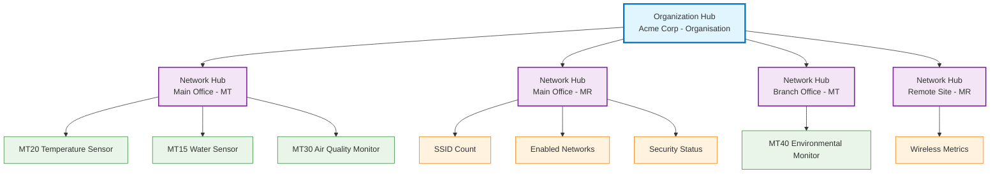

This custom integration connects your Meraki Dashboard with Home Assistant, providing real-time insights into your network devices and environmental sensors through a **scalable multi-hub architecture**.

## Overview

### Multi-hub architecture

The integration automatically creates multiple specialized hubs for optimal organization and performance:



**Key Benefits:**
- **Automatic Organization**: Creates hubs only when devices exist
- **Per-Hub Intervals**: Optimize update frequency for each device type
- **Scalable Performance**: Distribute API load across multiple hubs
- **Device-Specific Features**: Tailored functionality per device type

### Supported devices

**🌡️ MT Series Environmental Sensors**
- **Models**: MT10, MT12, MT14, MT15, MT20, MT30, MT40
- **Metrics**: Temperature, humidity, CO2, TVOC, PM2.5, noise, air quality, water detection, door sensors, battery levels, electrical measurements

**📡 MR Series Wireless Access Points**
- **Models**: All MR series
- **Metrics**: SSID counts, enabled networks, security status

## Prerequisites

<div class="row">
  <div class="col-md-6">
    <div class="card mb-3">
      <div class="card-body">
        <h6 class="card-title"><i class="bi bi-house me-2"></i>Home Assistant</h6>
        <p class="card-text">Version 2024.1.0 or newer required</p>
      </div>
    </div>
  </div>
  <div class="col-md-6">
    <div class="card mb-3">
      <div class="card-body">
        <h6 class="card-title"><i class="bi bi-cloud me-2"></i>Meraki Account</h6>
        <p class="card-text">Dashboard account with API access enabled</p>
      </div>
    </div>
  </div>
  <div class="col-md-6">
    <div class="card mb-3">
      <div class="card-body">
        <h6 class="card-title"><i class="bi bi-router me-2"></i>Meraki Devices</h6>
        <p class="card-text">At least one MT or MR series device</p>
      </div>
    </div>
  </div>
  <div class="col-md-6">
    <div class="card mb-3">
      <div class="card-body">
        <h6 class="card-title"><i class="bi bi-wifi me-2"></i>Network Access</h6>
        <p class="card-text">Internet connection to reach Meraki API</p>
      </div>
    </div>
  </div>
</div>

## Installation

### HACS installation (recommended)

<div class="alert alert-info" role="alert">
  <i class="bi bi-lightbulb me-2"></i>
  <strong>Recommended:</strong> Use HACS for automatic updates and easier management.
</div>

**Add custom repository**
1. In HACS, select **Integrations**
2. Select the three dots in the top right corner
3. Select **Custom repositories**
4. Add repository URL: `https://github.com/rknightion/meraki-dashboard-ha`
5. Select **Integration** as category
6. Select **Add**

**Install the integration**
1. Search for **Meraki Dashboard** in HACS
2. Select the integration
3. Select **Download**
4. Restart Home Assistant

### Manual installation

**Download and install files**
1. Go to the [latest release page](https://github.com/rknightion/meraki-dashboard-ha/releases)
2. Download `meraki_dashboard.zip`
3. Extract to `custom_components/meraki_dashboard/` in your Home Assistant config directory
4. Restart Home Assistant

## Configuration

### Get your API key

**Create API key in Meraki Dashboard**
1. Log in to [Meraki Dashboard](https://dashboard.meraki.com)
2. Go to **Organization → Settings → Dashboard API access**
3. Select **Generate new API key**
4. Enter description: "Home Assistant Integration"
5. Select **Generate API key**
6. Copy the key immediately (you won't see it again)

### Add the integration

**Configure in Home Assistant**
1. Go to **Settings → Devices & Services**
2. Select **Add Integration**
3. Search for **Meraki Dashboard**
4. Enter your API key
5. Select your organization
6. Configure hub intervals (optional)

### Hub intervals

Configure update intervals for optimal performance:

- **MT Environmental Sensors**: 10 minutes (default)
- **MR Wireless Access Points**: 5 minutes (default)
- **Discovery**: 1 hour (default)

**Per-hub configuration**
1. Go to **Settings → Devices & Services → Meraki Dashboard → Configure**
2. Set individual hub scan intervals
3. Set hub discovery intervals

## Usage

### Device organization

The integration creates a clear hierarchy:
- **Organization Device**: Shows overall connection status
- **Network Hub Devices**: One per network per device type
- **Individual Devices**: Your actual sensors nested under hubs

### Creating automations

**Environmental monitoring automation**
```yaml
automation:
  - alias: "High temperature alert"
    trigger:
      - platform: numeric_state
        entity_id: sensor.mt20_office_temperature
        above: 25
    action:
      - service: notify.notify
        data:
          message: "Office temperature is {{ states('sensor.mt20_office_temperature') }}°C"
```

**Water detection automation**
```yaml
automation:
  - alias: "Water leak detected"
    trigger:
      - platform: state
        entity_id: binary_sensor.mt15_basement_water_present
        to: 'on'
    action:
      - service: notify.mobile_app_your_phone
        data:
          message: "Water detected in basement!"
          data:
            priority: high
```

### Building dashboards

**Environmental dashboard card**
```yaml
type: entities
title: Environmental Monitoring
entities:
  - sensor.mt20_office_temperature
  - sensor.mt20_office_humidity
  - sensor.mt20_office_co2
  - binary_sensor.mt15_basement_water_present
```

**Network status card**
```yaml
type: entities
title: Network Status
entities:
  - sensor.mr_main_office_ssid_count
  - sensor.mr_main_office_enabled_ssids
  - sensor.mr_main_office_open_ssids
```

## Troubleshooting

### Common issues

**Integration not found**
- Ensure HACS is installed and configured
- Restart Home Assistant after HACS installation
- Clear browser cache and retry

**Invalid API key errors**
- Verify no extra spaces in the API key
- Check API key hasn't expired in Meraki Dashboard
- Ensure API key has organization read access

**No devices discovered**
- Verify devices are online in Meraki Dashboard
- Check devices are supported (MT or MR series)
- Ensure devices have recent data

**Missing sensor data**
- Different MT models support different sensors
- Check device model specifications
- Verify sensors are enabled in Meraki Dashboard

### Debug logging

Enable detailed logging for troubleshooting:

```yaml
logger:
  default: warning
  logs:
    custom_components.meraki_dashboard: debug
```

### Getting help

<div class="alert alert-info" role="alert">
  <i class="bi bi-question-circle me-2"></i>
  For additional help, check our <a href="faq.md" class="alert-link">FAQ</a> or report issues on <a href="https://github.com/rknightion/meraki-dashboard-ha/issues" class="alert-link">GitHub Issues</a>.
</div>
