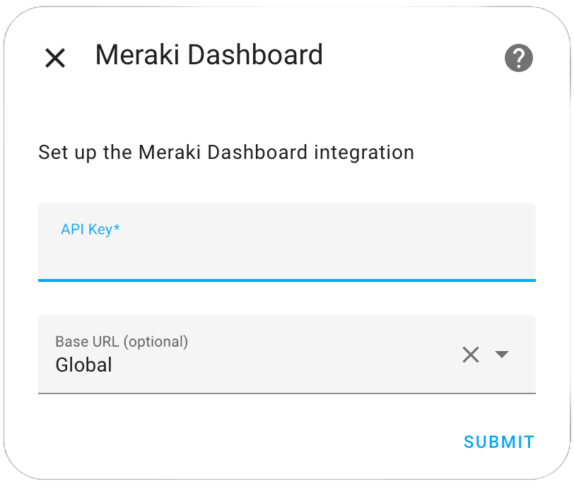
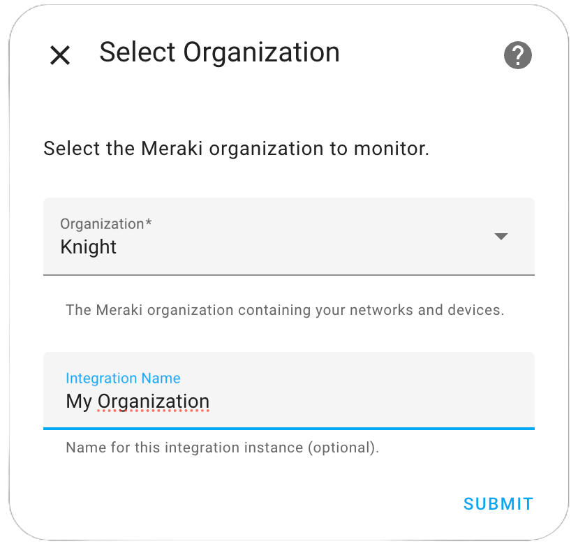
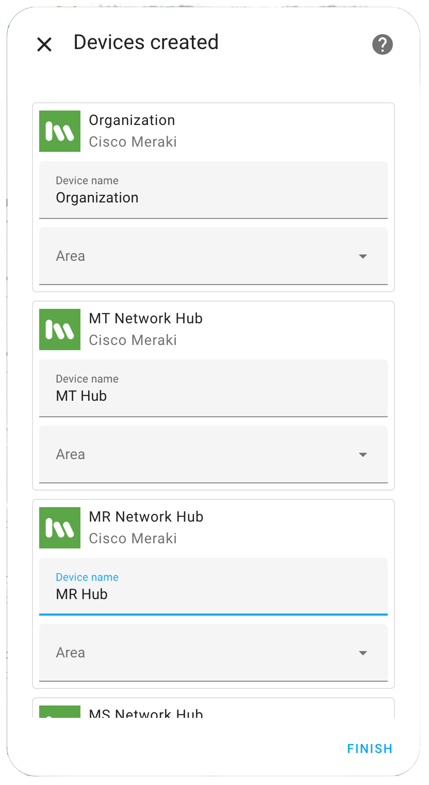

# Meraki Dashboard Home Assistant Integration

Connect your Cisco Meraki Dashboard with Home Assistant to monitor your Meraki MT environmental
sensors - all from your smart home automation platform.

!!! warning "Breaking change in v1.0.0"
    Version 1.0.0 is a **major, breaking release**. This integration now supports **only Meraki MT
    environmental sensors** — MR wireless access point, MS switch, and MV camera support has been
    **removed entirely**. Upgrading auto-migrates your configuration and removes any non-MT
    devices/entities, raising a repair notice in Settings → Repairs. See
    [Getting Started](getting-started.md) for details.

## What is this integration?

This custom integration provides real-time monitoring of your Cisco Meraki MT environmental
sensors directly within Home Assistant. Monitor temperature, humidity, air quality, and device
health across your entire Meraki organization.

## Key Features

- **🌡️ Environmental Monitoring**: Track temperature, humidity, CO2, air quality, and more from MT sensors
- **⚡ Ultra-Fast Updates**: 7.5-second refresh for MT15/MT40 devices with automatic refresh commands
- **🏢 Multi-Site Support**: Automatically organizes devices by network and location
- **⏱️ Smart Polling**: Device-specific update intervals optimized for MT sensors

## Supported Devices

- **MT Series**: Environmental sensors (MT10, MT12, MT14, MT15, MT20, MT30, MT40)

## Quick Start

Ready to get started? The setup process is simple:

1. **Install** the integration via HACS (available in the default repository) or manually

2. **Configure** your Meraki API key

3. **Select** your organizations and devices

4. **Monitor** your devices in Home Assistant

  <a href="getting-started" class="md-button md-button--primary md-button--stretch">
    🚀 Get Started Now
  </a>

---

  <i class="bi bi-question-circle me-2"></i>
  For detailed installation instructions, configuration options, and troubleshooting help, check our <a href="getting-started.md" class="alert-link">Getting Started Guide</a>.

